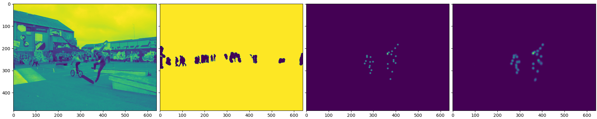
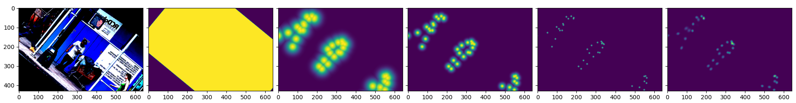
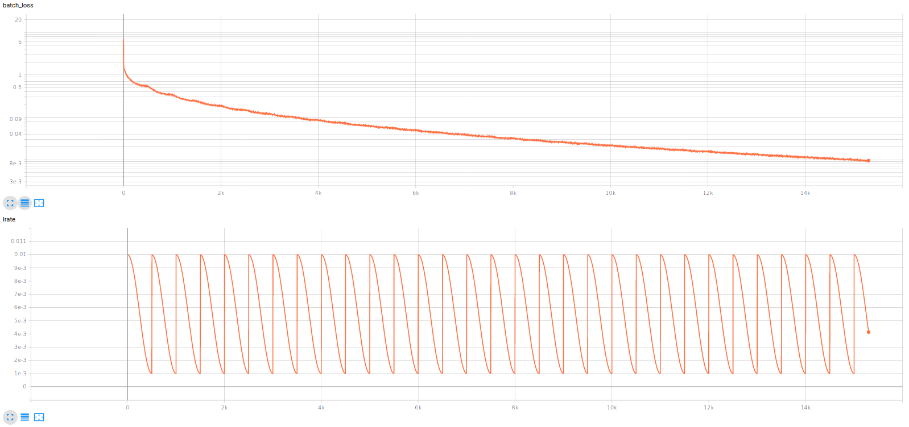
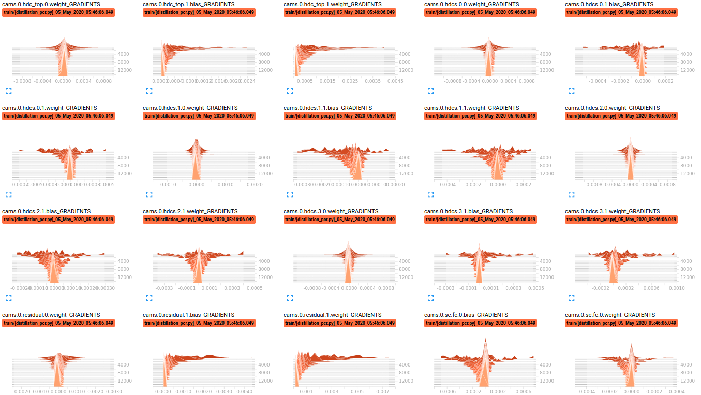
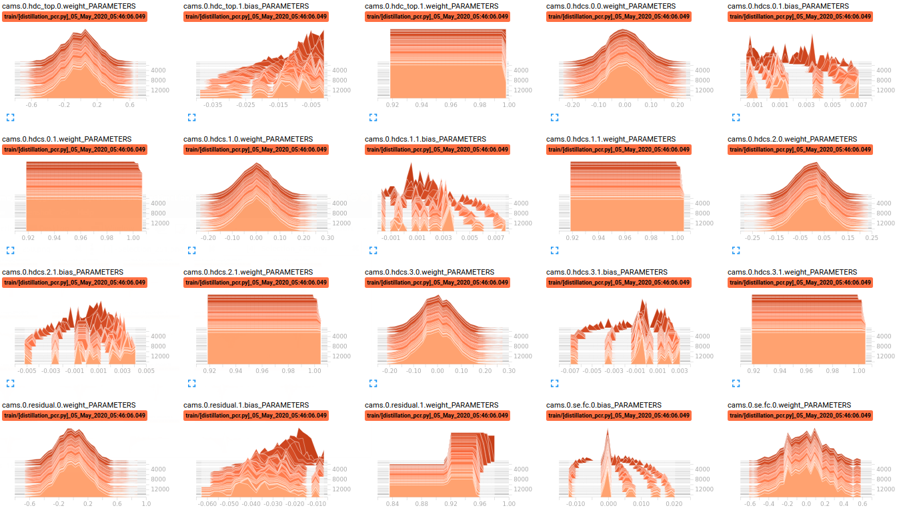
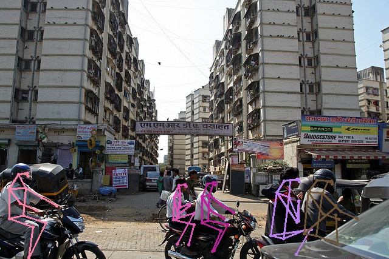
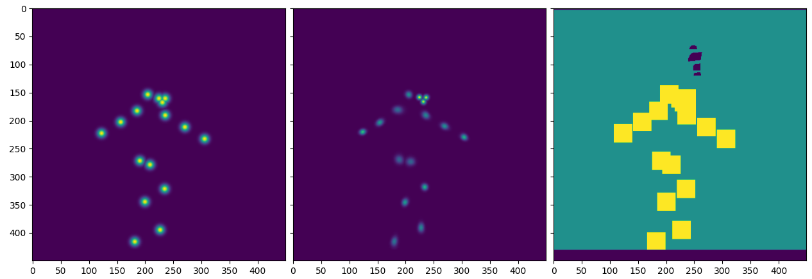
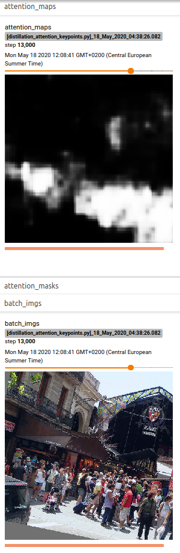
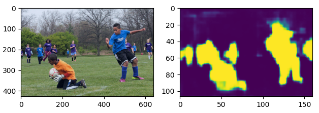
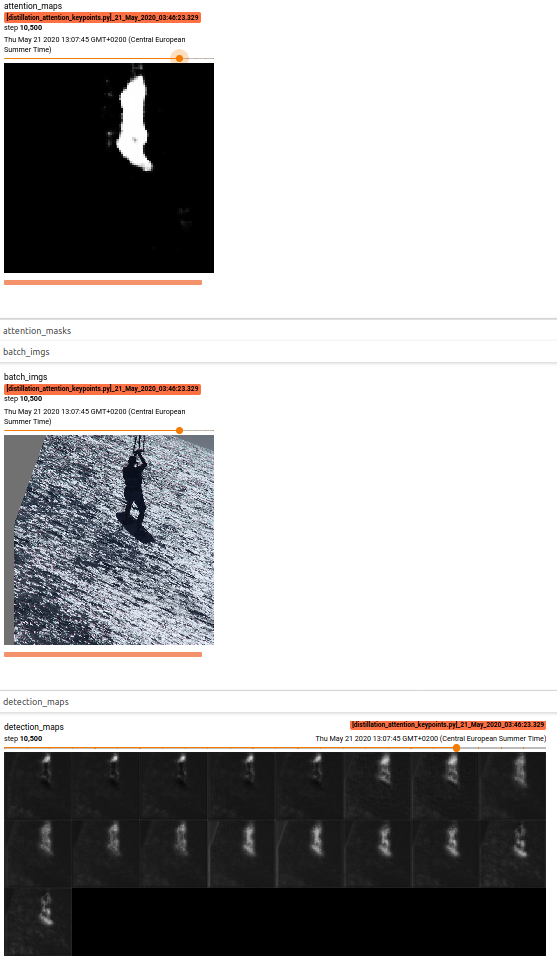

# REALTIME POSE ESTIMATION

The goal of this repository is to achieve real-time, multi-person, keypoint-based pose estimation, with competitive compromise between runtime/size and performance. Translation to monocular 3D estimation and lightweight applications is also explored.

Check the [LICENSE](LICENSE) for details on the usage conditions.


## Usage

The dependencies are mostly the same as for HigherHRNet: This `Python 3` project is based on PyTorch and uses TensorboardX for visualization. All dependencies can be easily installed via `pip`. **Important**: at the moment coco API and np==1.18 crash. use 1.17 https://github.com/xingyizhou/CenterNet/issues/547

Reusable code is found in the `rtpe` package. The applications present at the top of this repository make use of `rtpe` for different goals (check their docstrings and the project summary for more information).

The `models` directory is expected to contain the `pose_higher_hrnet_w48_640.pth.tar` statedict that can be downloaded from [here](https://drive.google.com/drive/folders/1hgKminLUNddejJfYpJkuahha8y6V5-UA) (check the HigherHRNet repository if the link is broken).

The integrated COCO dataloaders also require the images and annotations to be in a specific format. Also, to save training time, the HigherHRNet predictions have been computed ahead of time using [teacher_inference.py](teacher_inference.py). Once all the data has been downloaded, the resulting structure should be adapted to the following:

```
datasets/coco
             /images
                    /train2017 -> 118.287 images
                    /val2017 -> 5000 images
             /annotations
                         /person_keypoints_train2017.json
                         /person_keypoints_val2017.json
             /hrnet_predictions
                               /train2017 -> 118.287 .npz files
                               /val2017 -> 5000 .npz files
```


## Project Summary

The project started with a review of current related literature, see [here](assets/background.md). The conclusion was that [neural distillation](https://arxiv.org/abs/1503.02531) using a bottom-up state-of-the-art teacher is the most plausible approach. For that, [HigherHRNet](https://github.com/HRNet/HigherHRNet-Human-Pose-Estimation) was chosen as teacher due to its high performance (best existing bottom-up approach), manageable size and availability of software.

For the student architecture, the existing training constraints (single 8GB GPU) together with some experimenting with the different options yielded the following considerations:

* The *Context-Aware Modules* from the *Progressive Context Refinement* paper were chosen as building block.
* Intermediate supervision using segmentation is used to help the student learn the explicit progressive refinements.
* Since most of the models use a backbone/stem for representation learning (and many of them transfer from imagenet), we consider that explicit distillation of the teacher's stem may be beneficial for the student as well.

All of these ideas aim to achieve context-sensitivity while keeping good spatial resolution and low memory/runtime requirements. The protocol to achieve a working model is the following:

  1. Fix the teacher-stem, and train the student segmentation on the top
  2. Once good human segmentation is achieved, use it as attention to further detect the keypoints.
  3. Once good detection is achieved, replace the stem with a student-stem, fix the student-detector on the top and train the stem. Explore the usage of HSV/LAB color spaces and change from fp16 to fp32 to support CPU computation.
  4. Expand/transfer the student architecture into 3D exploring the techniques covered at the end of the literature review.

The project is currently advancing phase 2: The best performing HigherHRNet has been integrated and reproduced. The model has been used to generate predictions for all the COCO `train2017` and `val2017` images (around 400GB of results). Dataloaders and optimizers for distillation have been implemented. Infrastructure for distillation (logging, model serialization, minival...) has been completed. Student learns reasonable segmentation, and already recognizes some body parts (in the praxis both segmentation and keypoints can be trained jointly from scratch).

See the images below for some examples. Also check the [explorations](assets/explorations.md) section for more details of the ongoing work.


## Gallery

COCO dataloader input example: image, mask and 2 generated ground truth summaries with different spreads



Distillation setup example: image, mask, ground truth and HigherHRNet output


Data augmentation example: image, different ground truths and HigherHRNet output have been randomly rotated, shifted, rescaled and cropped. Images have also been normalized according to dataset distribution



Batch loss and learning rate summary during training



Histograms showing the evolution of gradients during training for a few layers



Histograms showing the evolution of parameters during training for a few layers




Teacher output examples of the `validate_hhrnet.py` script:




Masks used for keypoint mining: gradients are multiplied by this masks, allowing the model to focus on specific regions:



### Student output examples:

Attention map for a COCO training instance:



Attention map for a COCO validation instance:



Attention map and body part detection for a COCO training instance:




