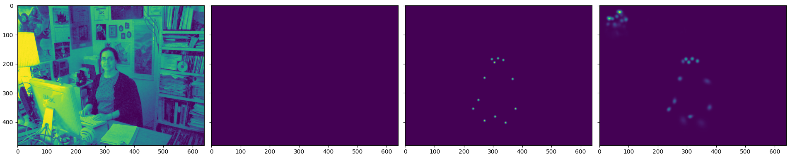
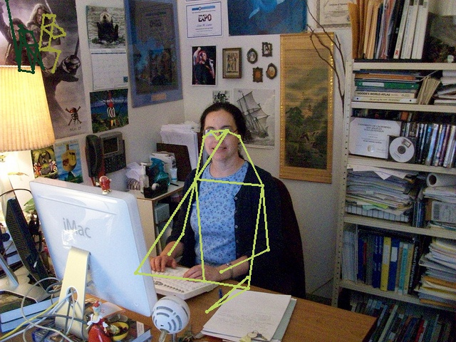

# REALTIME POSE ESTIMATION

The goal of this repository is to achieve real-time, multi-person, keypoint-based pose estimation, with competitive compromise between runtime/size and performance. Translation to monocular 3D estimation and lightweight applications is also explored.

Check the [LICENSE](LICENSE) for details on the usage conditions.


## Usage

The dependencies are mostly the same as for HigherHRNet: This `Python 3` project is based on PyTorch and uses TensorboardX for visualization. All dependencies can be easily installed via `pip`. **Important**: at the moment coco API and np==1.18 crash. use 1.17 https://github.com/xingyizhou/CenterNet/issues/547

Reusable code is found in the `rtpe` package. The applications present at the top of this repository make use of `rtpe` for different goals (check their docstrings and the project summary for more information).

The `models` directory is expected to contain the `pose_higher_hrnet_w48_640.pth.tar` statedict that can be downloaded from [here](https://drive.google.com/drive/folders/1hgKminLUNddejJfYpJkuahha8y6V5-UA) (check the HigherHRNet repository if the link is broken).

The integrated COCO dataloaders also require the images and annotations to be in a specific format. Also, to save training time, the HigherHRNet predictions have been computed ahead of time using [teacher_inference.py](teacher_inference.py). Once all the data has been downloaded, the resulting structure should be adapted to the following:

```
datasets/coco
             /images
                    /train2017 -> 118.287 images
                    /val2017 -> 5000 images
             /annotations
                         /person_keypoints_train2017.json
                         /person_keypoints_val2017.json
             /hrnet_predictions
                               /train2017 -> 118.287 .npz files
                               /val2017 -> 5000 .npz files
```


## Project Summary

The project started with a review of current related literature, see [here](assets/background.md). The conclusion was that [neural distillation](https://arxiv.org/abs/1503.02531) using a bottom-up state-of-the-art teacher is the most plausible approach. For that, [HigherHRNet](https://github.com/HRNet/HigherHRNet-Human-Pose-Estimation) was chosen as teacher due to its high performance (best existing bottom-up approach), manageable size and availability of software.

Since most of the models use a backbone/stem for representation learning (and many of them transfer from imagenet), we consider that this representation may be beneficial for the student as well, and approach a 3-stage distillation, aiming for maximal compression:

  1. Fix the teacher-stem, and train the student-detector on the top
  2. Once good detection is achieved, replace the stem with a student-stem, fix the student-detector on the top and train the stem. Explore the usage of HSV/LAB color spaces and change from fp16 to fp32 to support CPU computation.
  3. Expand/transfer the student architecture into 3D exploring the techniques covered at the end of the literature review.

The project is currently on phase 1: The best performing HigherHRNet has been integrated and reproduced. The model has been used to generate predictions for all the COCO `train2017` and `val2017` images (around 400GB of results). Dataloaders and optimizers for distillation have been implemented. Infrastructure for distillation (logging, model serialization, minival...) has been completed.

A few student architectures have been explored, all of them inspired by different ideas from the review. The gallery images from the current best student (based on the *Progressive Context Refinement* model) show healthy loss decay, gradient convergence and parameter updates, which indicate the correct function of the infrastructure. Satisfactory performance on the validation set hasn't been achieved yet.

Check the [explorations](assets/explorations.md) section for details of the ongoing work.


## Gallery

COCO dataloader input example: image, mask and 2 generated ground truth summaries with different spreads


Distillation setup example: image, mask, ground truth and HigherHRNet output



Data augmentation example: image, different ground truths and HigherHRNet output have been randomly rotated, shifted, rescaled and cropped. Images have also been normalized according to dataset distribution


Batch loss and learning rate summary during training


Histograms showing the evolution of gradients during training for a few layers


Histograms showing the evolution of parameters during training for a few layers


Output examples of the `validate_hhrnet.py` script. Note that the heatmaps have been extracted with the unmodified HigherHRNet model:



